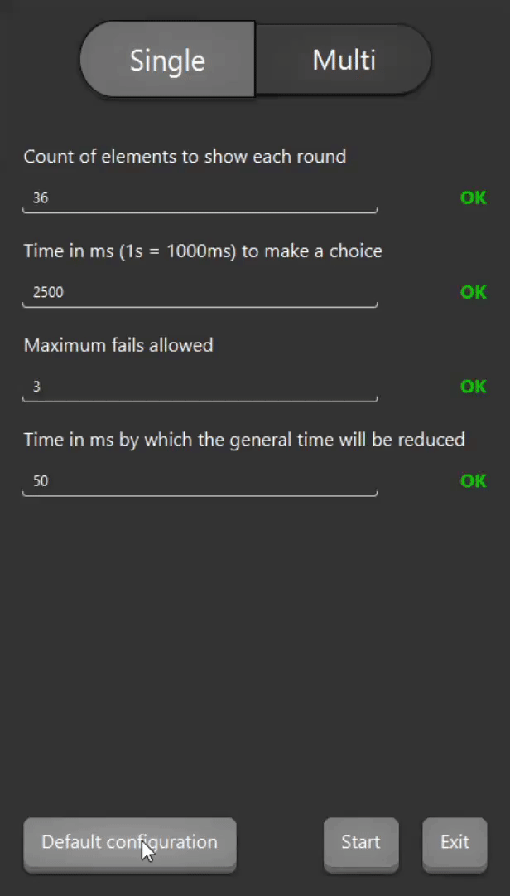
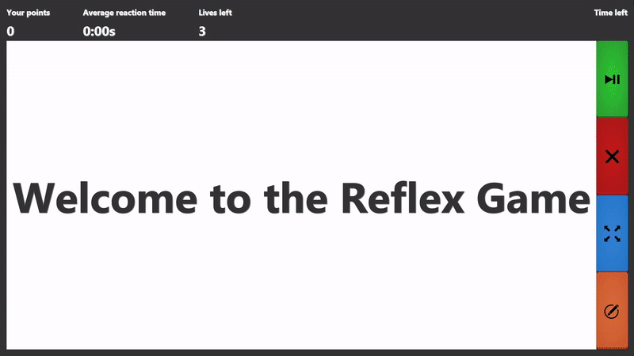

# Reflex Game
 The project for the Object Oriented Programming Course at AGH UST

## :gear: Requirements and building

```git
git clone https://github.com/Goader/reflex_game.git
```

* JDK 15
* Gradle 15
* Dependencies from [build.gradle](https://github.com/Goader/reflex_game.git)

**Using IntelliJ is strongly recommended**

_To run the application use **`Gradle` -> `Tasks` -> `Application`-> `run`**._

**The game is designed for FullHD screens**

## :control_knobs: Launcher
All the game parameters, as well as the mode (arcade or against the computer), are selected and defined here.
More information about them below.

Both modes have their own parameters, but there are a few in common. Let's take a quick look at them.

#### :card_file_box: General parameters
* Count of elements to show each round
    * as the game is based on finding the right icon and clicking on it as fast as we can, we need the icons
    themselves. This parameter defines how many icons we will see each round with the one we are trying to find.
* Time in ms (1s = 1000ms) to make a choice
    * to make this game interesting, of course, we add the time limit to find the icon. Here we set the time
    in ms (milliseconds) which we will be given to find the icon.

### :moyai: Single (arcade)
This mode can be called "arcade" as we have a few lives (possibilities to fail), and then we go on to get 
as many points as we can before are lives will be over.

#### :card_file_box: Parameters
* Maximum fails allowed
    * We define everything that is not the clicking on the right icon in the given time as a failure. We
    can set the count of fails allowed before the program tells us that the game is over.
* Time in ms by which the general time will be reduced
    * To make this a little more interesting. We can reduce our time to find the icon by the set amount.
    This amount we define as the parameter.

### :robot: Multi (against the computer)
This mode is already more about the competition. We play against a computer. We both have the same time to
find the right icon. If someone answers first correctly, he gets a point, wrongly - he loses a point, 
doesn't answer, or the opponent does it first - the points remain as they were.

#### :card_file_box: Parameters
* Average choice in ms for the computer
    * the so-called "computer" is only a random generator using the specific exGaussian distribution which
    describes the response time in statistics. It is a sum of normal and shifted exponential distributions.
    This parameter defines the peak of the exGaussian distribution, or the mean of normal to which the
    exponential is shifted. In short, defines how fast the computer will find the icon (not necessarily
    the right one).
* Chance for the computer to make the right choice
    * This already defines the chance that the computer makes a right choice, clicks on the right icon.

### :no_entry: Parameters domains
All the parameters have their finite-element domains. We'll define them below. All the intervals are 
inclusive on the both sides.

* Count of elements to show each round
    * integer, from 2 to 36
* Time in ms (1s = 1000ms) to make a choice
    * integer, from 200ms to 3600000ms (from 0.2s to 1 hour)
* Maximum fails allowed
    * integer, from 0 to 1000
* Time in ms by which the general time will be reduced
    * integer, from 0ms to 3600000ms (from "the time is not being reduced" to 1 hour)
* Average choice in ms for the computer
    * integer, from 200ms to 3600000ms (from 0.2s to 1 hour)
* Chance for the computer to make the right choice
    * double, from 0 to 1 (as in the probability theory, 0 - always wrong choice, 1 - always right choice)

**The program will not let you start with the parameter's value out of his domain.**

### :film_strip: Example of using the launcher


## :video_game: Game
Let's see how the typical round of the game looks, and we'll base our following description on it.



Let's discuss all the round phases!

* Try to find this icon
    * This phase shows us the icon we need to find among others.
* Countdown
    * Get ready, because there is not much time :grinning:
* The icons
    * You see the board with lots of icons randomly rotated. You need to find the one you've been shown to
    and click on it.
* Result
    * After clicking/time passing you see the result message which may differ in single and multi modes.
    
### :joystick: Control panel
You can see 4 different buttons on the right side of the board. Let's see what they can do!

* :green_book: - this one pauses the game, the next round will not be started automatically until you
press it again.
* :closed_book: - stops the running application. The best way to close the game.
* :blue_book: - full screen toggle. Use it to turn on and off full screen state.
* :orange_book: - write statistics. Writes to the JSON file your reaction times in this game.

### :chart_with_upwards_trend: Status panel
The boxes on the upper panel have self-descriptive names that clearly illustrate what does the value mean.

## :keyboard: Created by [@Goader](https://github.com/Goaderhttps://github.com/Goader)
